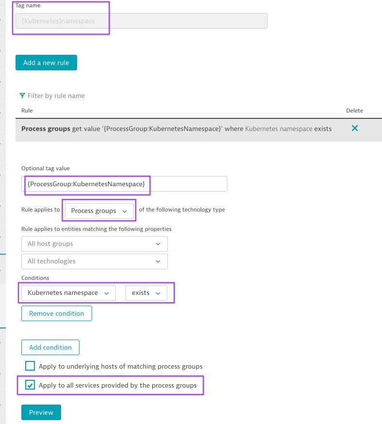

# Dynatrace Dashboards for getting an overview of your Kubernetes Clusters

### Kubernetes Clusters Overview
Dashboards for getting an overview of your Kubernetes Clusters, your Applications/Namespaces Health and it's utilization.

## Import it in seconds via BizOps Configurator

1. **[(Click here)](https://dynatrace.github.io/BizOpsConfigurator/#deploy/persona/Ops/Platform%20Overview/K8s%20Overview)** to open the BizOps configurator preloaded with this Dashboards

2. **Add** your **tenantUrl** and **API-Token**

3. **Click next**. *The persona, usecase and workflow is already selected for you.* 

4. **Click Done**

Enjoy your new Kubernetes Dashboards 

> ⚠️ In order for the entities to be shown properly, you'll need to add a tag `[Kubernetes]namespace` to your services/pods. This is because the **Performance Engineering Dashboard** only shows transactions monitored in Kubernetes environments, the filter applies here. This will be later OOTB in the product.  See how to [Automatically add the namespace tag to all your containers (pgi) and services](#automatically-add-the-namespace-tag-to-all-your-containers-pgi-and-services)
> 
> ⚠️ Works with Dynatrace 196+

## 📊 Dashboards 

### Kubernetes Overview

### Cluster utilization
_____________________
See the Kubernetes cluster utilization. CPU and Memory Request and limits over time for all nodes and splitted by namespaces.

### Resource Quotas
_____________________
Get an overview and understanding of the Kubernetes resource quotas (Memory and CPU) assigned to your namespaces and its usage. 

### Container usage & health
_____________________
Understand the health and phases of your Pods in your clusters. Their memory and cpu usage, which pods are throttled, have failed or are pending to be scheduled. Also check if you have Out-of-memory killed containers.

### Performance Engineering
_____________________
Give your developers and SRE engineers all they need to understand and improve the performance of each app, pod and each transaction on your clusters. View the response time percentiles, slow transactions, database executions per microservice, its network usage and more. Filter the transactions by App label, namespace and much more.  

### User Experience
_____________________
Are your endusers satisfied? how is the engagement, experience and user behaviour of your applications? Get the insights of all your applications and users in an instance.

## Automatically add the namespace tag to all your containers (pgi) and services 
_____________________

| Step  | Description  |
| ------------- | ------------- |
| 1. Add a tag (key) with the name **[Kubernetes]namespace**  | This is so the filter defined in the dashboard matches the tag. The name must be exact (yes with brakets)  |
| 2. As tag value we add in curly brakets **{ProcessGroup:KubernetesNamespace}** | This means that as a value the namespace (if found) will be assigned automatically. This value is captured automatically for all your pods (or containers) in your environment |
| 3. Select the condition **Kubernetes namespace** **exists** | Which means that this rule will only apply to processes where a Kubernetes namespace is found  |
| 4. Rule applies to **Process groups** | We select the ProcessGroup (container clusters) as the Entity where we apply this tagging rule |
| 5. Check "Apply to all services provided by the process groups" | We tell Dynatrace to all detected services (where the purepaths of your containers are captured and measured) by any container to inherit this tagging, hence you can list and filter anywhere in Dynatrace transactions by namespace |

