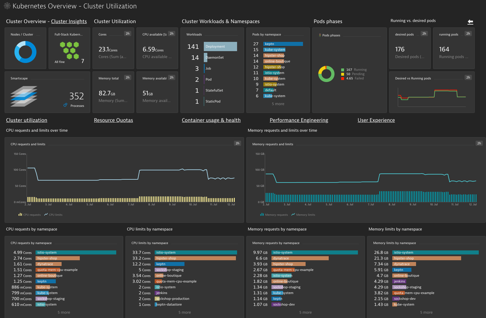
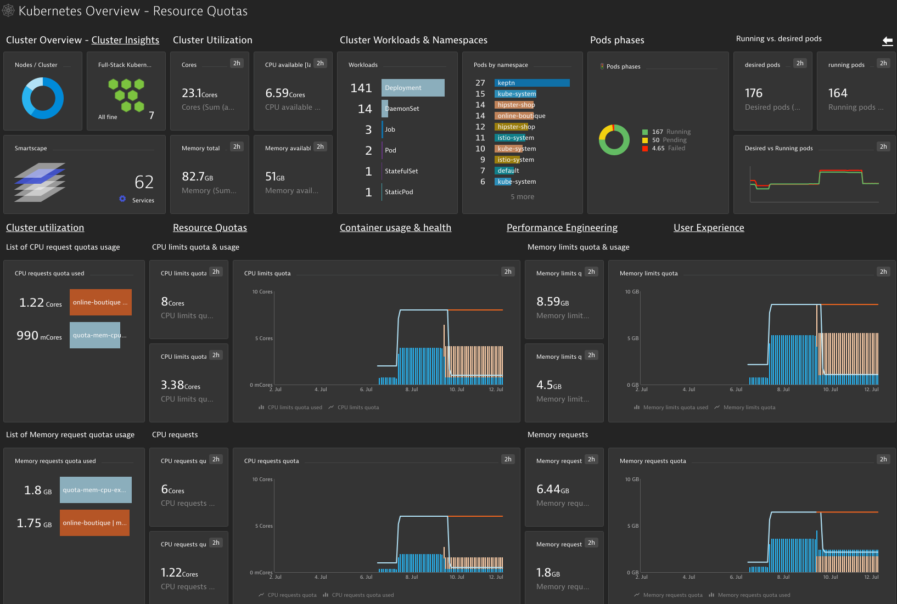
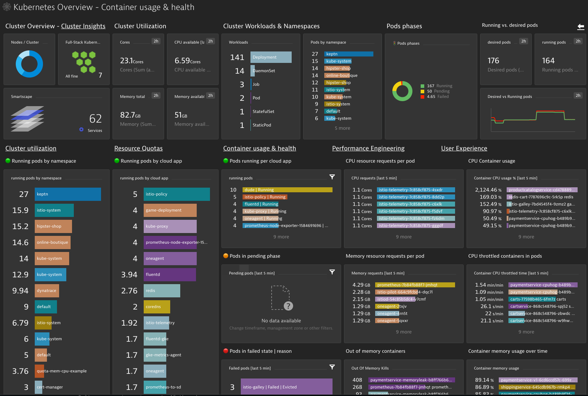
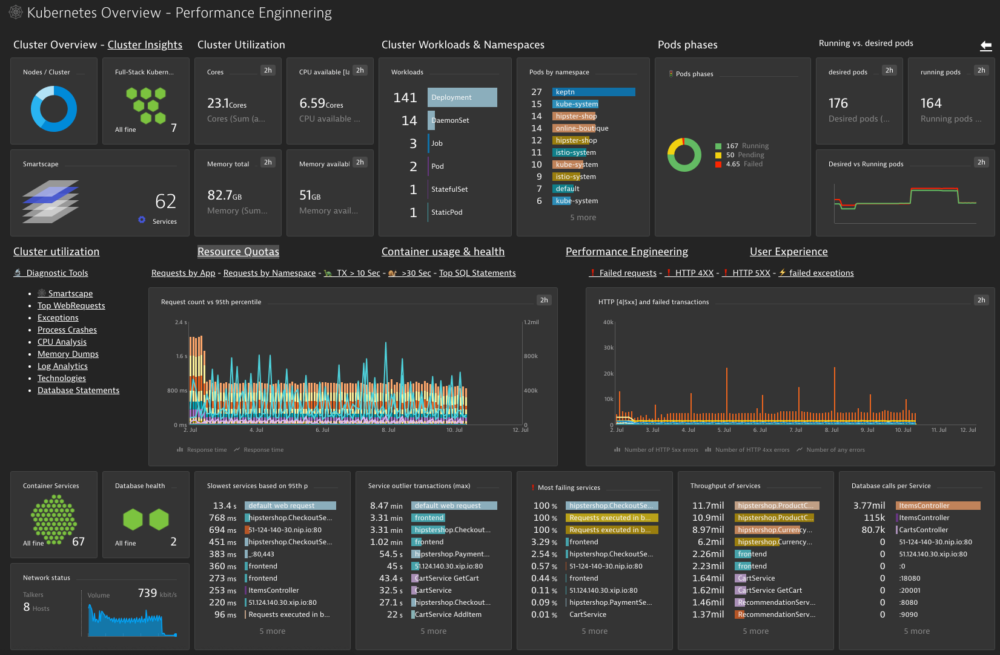
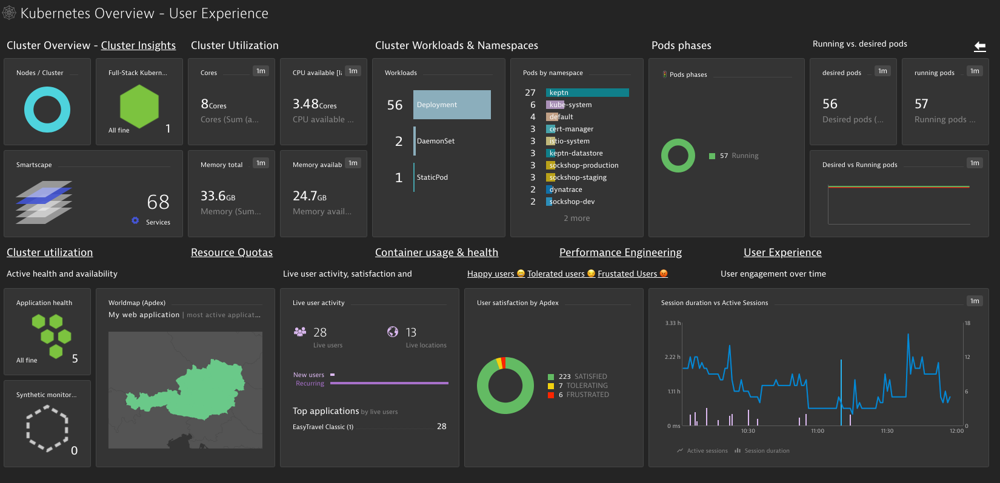

# Dynatrace Dashboards for getting an overview of your Kubernetes Clusters

### Kubernetes Clusters Overview
Dashboards for getting an overview of your Kubernetes Clusters, your Applications/Namespaces Health and it's utilization.

Import via BizOps configurator **[(Instructions here)](how-to-import-using-bizops.md)**

https://dynatrace.github.io/BizOpsConfigurator/

⚠️ In order for the entities to be filtered properly, you'll need to add a tag `[Kubernetes]namespace` to your services/pods, so this could be filtered properly in the performance engineering dashboard. This will be later OOTB in the product. 

### Overview

### Cluster utilization
_____________________
See the Kubernetes cluster utilization. CPU and Memory Request and limits over time for all nodes and splitted by namespaces.

### Resource Quotas
_____________________
Get an overview and understanding of the Kubernetes resource quotas (Memory and CPU) assigned to your namespaces and its usage. 

### Container usage & health
_____________________
Understand the health and phases of your Pods in your clusters. Their memory and cpu usage, which pods are throttled, have failed or are pending to be scheduled. Also check if you have Out-of-memory killed containers.

### Performance Engineering
_____________________
Give your developers and SRE engineers all they need to understand and improve the performance of each app, pod and each transaction on your clusters. View the response time percentiles, slow transactions, database executions per microservice, its network usage and more. Filter the transactions by App label, namespace and much more.  

### User Experience
_____________________
Are your endusers satisfied? how is the engagement, experience and user behaviour of your applications? Get the insights of all your applications and users in an instance.

